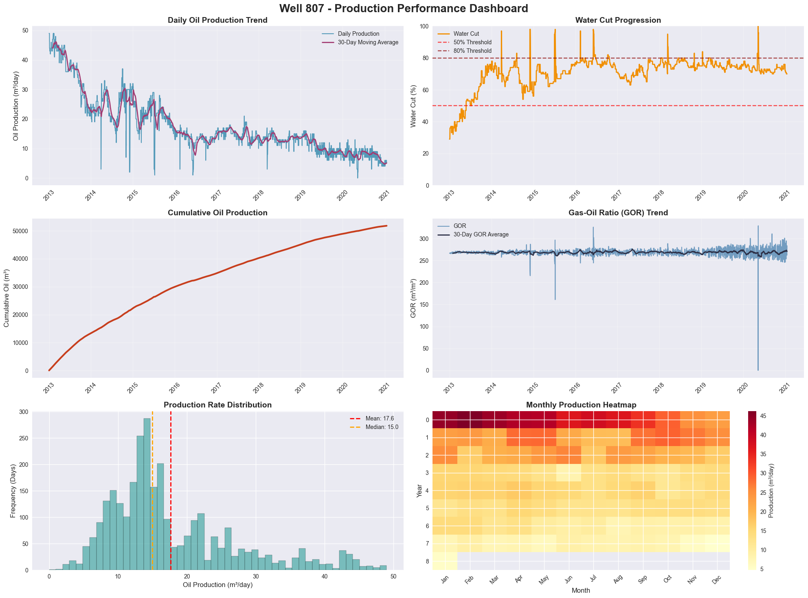
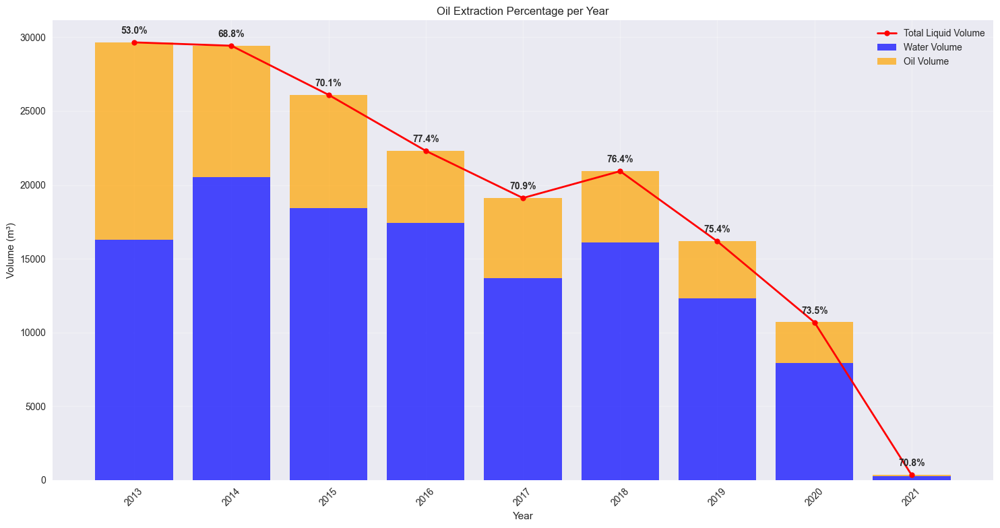
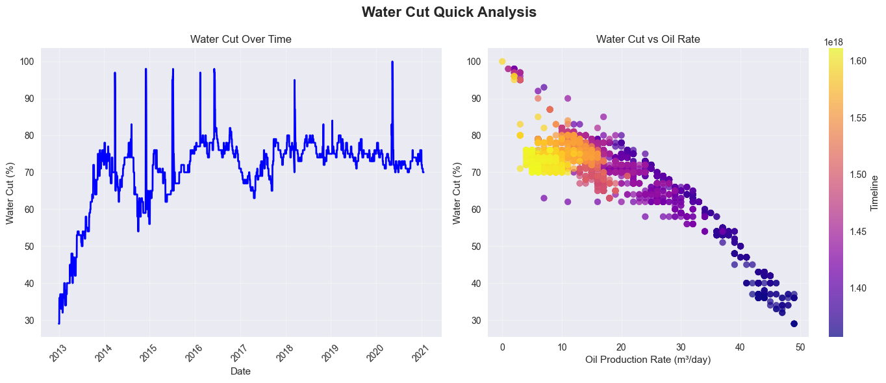
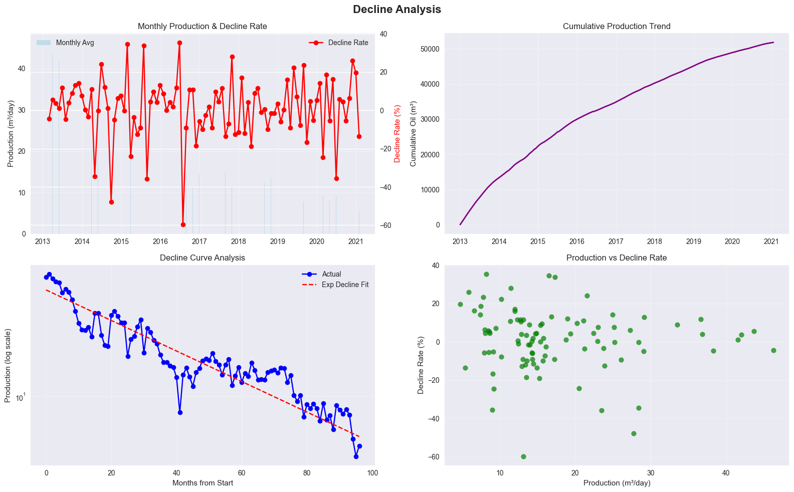
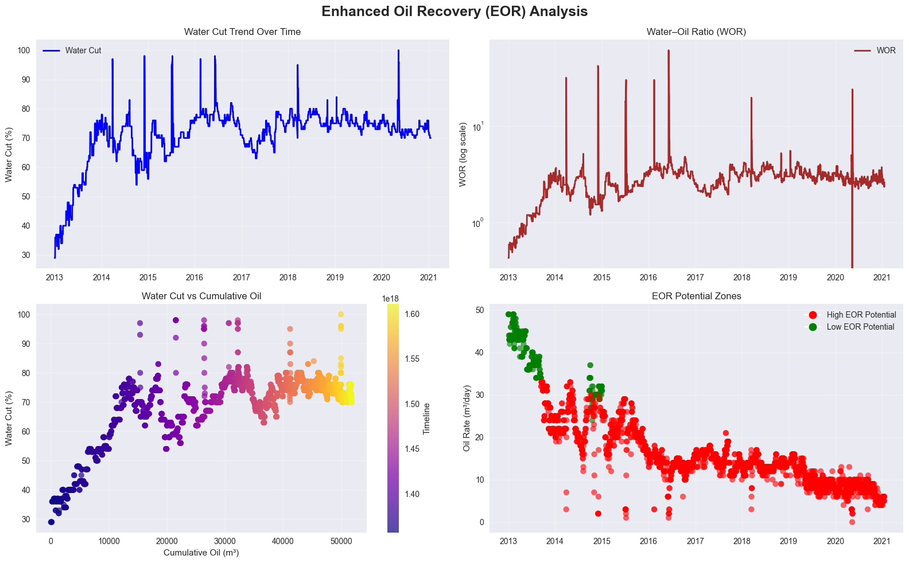

# 🛢️ Well #807 — Production Performance Summary Report (2013–2021)
*Based on operational data and dashboard analysis*

---

## 1. Overview

**Well #807**, located in **Northern Siberia**, was drilled in **2013** to a depth of **2,400 meters**.  
It produces a mixture of **oil, gas, and water**.  

Daily monitoring of key parameters — such as **oil volume**, **water cut**, **gas–oil ratio (GOR)**, and **reservoir pressure** — has enabled detailed performance tracking throughout its operational life.

---

## 2. Key Trends (2013–2021)

### 🛢️ Oil Production Decline
- **Initial production (2013):** ~45–50 m³/day  
- **By 2021:** stabilized around **5–6 m³/day**, representing an **≈90% decline** from peak.  
- The **steepest drop** occurred between **2013–2016**, followed by a slower, steady decline.

### 💧 Water Cut Increase
- **2013:** started at **~30%**  
- **2016 onward:** consistently above **70%**, reaching **>90%** during operational disruptions (e.g., mid-2014, mid-2016).  
- High water cut confirms **reservoir depletion**, as water production dominates while oil extraction declines.

### 🔥 Gas–Oil Ratio (GOR)
- Stable in early years.  
- Became **volatile after 2017**, indicating changing reservoir dynamics or potential gas breakthrough.

### ⛽ Reservoir Pressure
- Declined from **214 atm (2013)** → **~100 atm (2021)** — a **>50% drop**.  
- Directly correlated with reduced oil production rates.

---

## 3. Operational Phases & Key Events

### 🟢 Early Life (2013–2015)
- Stable, high oil output with moderate water cut (<50%).  
- Reservoir pressure decline began but remained sufficient for natural flow.

### 🟡 Mid-Life Decline (2016–2019)
- Oil production dropped below **20 m³/day**.  
- Water cut exceeded **75%**, suggesting increasing water encroachment.  
- Occasional short-term production spikes indicate **minor interventions or workovers**.

### 🔴 Late Life & Pandemic Impact (2020–2021)
- Production stabilized at very low levels (~5–10 m³/day).  
- **Covid-19 Impact:**  
  - In **May 2020**, production briefly dropped to **0 m³/day**.  
  - Likely caused by reduced staffing, supply chain issues, or temporary shutdowns during **Russia’s pandemic restrictions**.  
  - Recovery was **slow and partial**, never returning to pre-2020 levels — a mix of **natural decline and operational limitations**.  
- Reduced **working hours** and **maintenance activities** may have accelerated performance degradation.

---

## 4. Economic & Technical Outlook

- The well is in a **late-maturity stage**, with:
  - **High water handling costs**  
  - **Low oil yield**
- **EOR (Enhanced Oil Recovery) potential** is limited due to:
  - Persistent **>90% water cut**
  - **Low reservoir pressure (~100 atm)**
- Continued operation is likely **marginally economical**, unless supported by **subsidies** or **field-wide EOR projects**.

---

## 5. Data Visualization Preview 📈

### Oil Production Trend

### Oil Extraction Per Year

### Water Cut Over Time

### Decline Curve Analysis

### EOR Analysis

---

## 6. Conclusion

Well #807 has followed a **classic production decline curve**, driven by **natural reservoir depletion**.  
The **Covid-19 pandemic (2020)** exacerbated operational challenges, causing a temporary halt and slower recovery.  

Given current performance metrics:
- The well is **nearing the end of its productive life**.  
- Future decisions should **weigh decommissioning costs** against the **minimal remaining oil recovery potential**.

---

📊 *Source: Field Production Data (2013–2021)*
