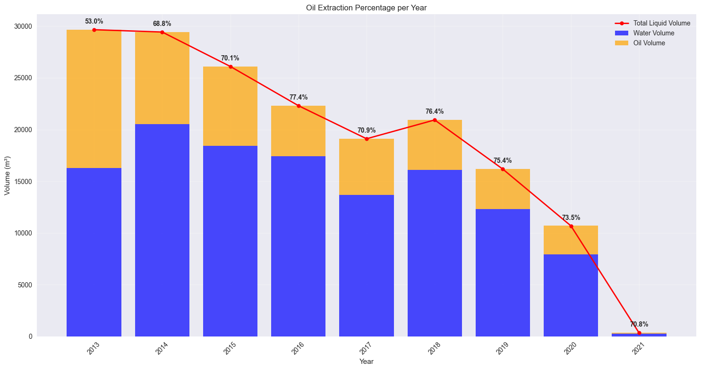
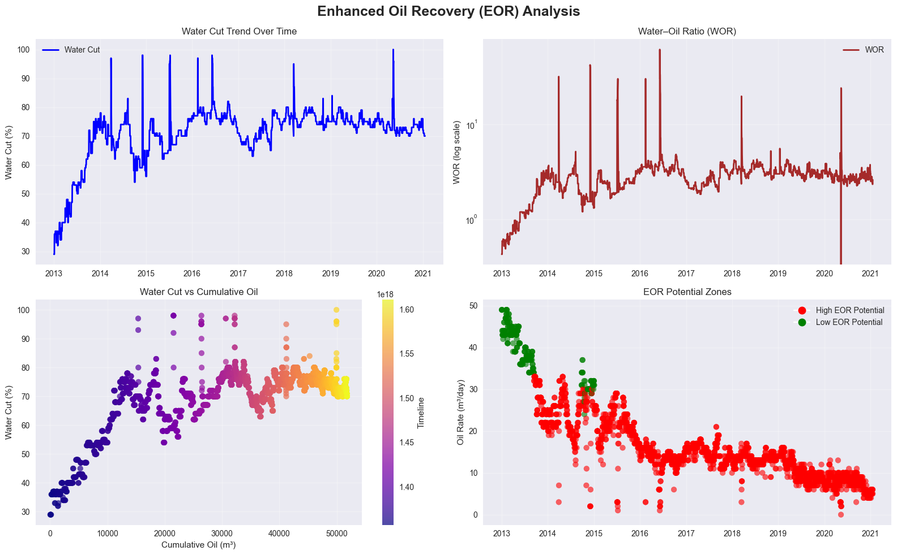

# Oil Well #807 Production & EOR Analysis

## Project Overview

<p align="justify">
This project analyzes the production performance of <b>Oil Well #807</b> using historical operational data from <b>2013 to 2021</b>. The objective is to evaluate long-term production decline, water cut behavior, reservoir pressure depletion, gas-oil ratio changes, and the potential for <b>Enhanced Oil Recovery (EOR)</b>.
</p>

<p align="justify">
The analysis demonstrates how Python-based data analytics can support oil and gas production performance evaluation, reservoir monitoring, and technical decision-making for mature wells.
</p>

---

## Business & Technical Context

<p align="justify">
Oil wells naturally decline over time due to reservoir depletion, increasing water production, pressure reduction, and operational constraints. For mature wells, production engineers and decision-makers need to understand whether continued operation remains technically and economically reasonable.
</p>

This project was designed to answer key questions such as:

* How did oil production change between 2013 and 2021?
* When did the well enter a mature decline phase?
* How did water cut evolve over time?
* What is the relationship between pressure decline and oil production reduction?
* Did operational disruptions affect production performance?
* Is there meaningful potential for Enhanced Oil Recovery?
* Should the well continue operating, be optimized, or move toward decommissioning consideration?

---

## Dataset Description

<p align="justify">
The dataset contains historical production and reservoir performance indicators for Well #807, including oil production volume, water production behavior, water cut percentage, gas-oil ratio, reservoir pressure, and time-based production records from 2013 to 2021.
</p>

> Note: The dataset is used for analytical and portfolio demonstration purposes.

---

## Tools & Technologies

* Python
* Pandas
* Matplotlib
* Jupyter Notebook
* CSV Data
* Data Cleaning
* Data Visualization
* Decline Curve Analysis
* Oil & Gas Production Analysis

---

## Analysis Workflow

The project followed a structured data analysis workflow:

1. Data loading and inspection
2. Data cleaning and preparation
3. Time-series production trend analysis
4. Water cut trend evaluation
5. Reservoir pressure decline analysis
6. Gas-oil ratio behavior review
7. Decline curve interpretation
8. EOR potential assessment
9. Technical and economic outlook summary

---

## Key Production Trends

### Oil Production Decline

<p align="justify">
Oil production showed a major decline over the operating period. Initial production in 2013 was approximately <b>45–50 m³/day</b>, while by 2021 production stabilized around <b>5–6 m³/day</b>. This represents an approximate <b>90% decline</b> from peak production.
</p>

<p align="justify">
The steepest decline occurred between <b>2013 and 2016</b>. After 2016, the well entered a slower but persistent decline phase, indicating a transition from early productive life into a mature production decline stage.
</p>

---

### Water Cut Increase

<p align="justify">
Water cut increased significantly throughout the well’s operating life. It started around <b>30%</b> in 2013 and remained consistently above <b>70%</b> from 2016 onward. During some operational periods, water cut exceeded <b>90%</b>.
</p>

<p align="justify">
High water cut suggests increasing water production dominance, reduced oil efficiency, and a higher operational burden due to water handling and separation requirements.
</p>

---

### Gas-Oil Ratio Behavior

<p align="justify">
The gas-oil ratio remained relatively stable during the early production period but became more volatile after 2017. This may indicate changing reservoir behavior, gas breakthrough effects, or production instability associated with a mature well condition.
</p>

---

### Reservoir Pressure Decline

<p align="justify">
Reservoir pressure declined from approximately <b>214 atm in 2013</b> to around <b>100 atm by 2021</b>. This represents a decline of more than <b>50%</b>, which strongly supports the observed reduction in oil production rates.
</p>

<p align="justify">
Lower reservoir pressure reduces natural flow potential and increases the need for artificial lift optimization, pressure support, or other recovery strategies.
</p>

---

## Operational Phase Interpretation

### Early Life Phase: 2013–2015

During the early production stage, Well #807 showed relatively strong oil output with moderate water cut.

Key characteristics:

* Higher production rates
* Moderate water cut
* Sufficient reservoir pressure for natural production
* Early signs of pressure decline

---

### Mid-Life Decline Phase: 2016–2019

During this phase, the well experienced a clear production decline.

Key characteristics:

* Oil production dropped below **20 m³/day**
* Water cut exceeded **75%**
* Reservoir pressure continued to decline
* Short-term production fluctuations may indicate operational interventions or workover activity

---

### Late-Life Phase: 2020–2021

<p align="justify">
By 2020–2021, the well reached a late-maturity stage with low production rates and high water cut. Oil production stabilized at low levels, water cut remained very high, and reservoir pressure was significantly reduced.
</p>

<p align="justify">
A temporary production drop occurred around 2020, which may reflect operational disruption, shutdown, or external field constraints. The well did not recover to earlier production levels, suggesting that the decline was mainly driven by natural reservoir depletion combined with possible operational limitations.
</p>

---

## EOR Potential Assessment

<p align="justify">
The analysis indicates that the well has limited standalone EOR potential due to very high water cut, low remaining reservoir pressure, low oil production rate, mature decline behavior, and potentially high water handling costs.
</p>

<p align="justify">
However, EOR may still be considered if evaluated as part of a wider field-level recovery strategy rather than as an isolated well-level intervention.
</p>

Possible options for further technical evaluation may include:

* Water shutoff or conformance control
* Artificial lift optimization
* Workover feasibility assessment
* Field-level pressure support strategy
* Economic screening of continued operation versus abandonment

---

## Data Visualization Preview

### Oil Production Trend


### Oil Extraction Per Year



### Water Cut Over Time


### Decline Curve Analysis


### EOR Analysis



---

## Key Insights

* Well #807 followed a classic mature oil well decline pattern.
* Oil production declined by approximately **90%** between 2013 and 2021.
* Reservoir pressure dropped by more than **50%**, contributing to reduced production rates.
* Water cut increased significantly, exceeding **70%** after 2016 and reaching very high levels during late-life operation.
* High water cut and low oil output suggest increasing operating costs and reduced economic attractiveness.
* EOR potential appears limited at the single-well level unless supported by broader field-level recovery plans.
* The well is likely approaching the end of its productive life under current operating conditions.

---

## Recommendations

Based on the analysis, the following recommendations are suggested:

* Conduct an economic limit analysis to determine whether continued operation is financially justified.
* Evaluate water handling and separation costs due to high water cut.
* Review artificial lift performance and optimization opportunities.
* Investigate whether water shutoff or workover intervention could improve oil recovery.
* Consider EOR only within a field-wide technical and economic screening process.
* Compare decommissioning costs with the expected value of remaining recoverable oil.
* Continue monitoring pressure, water cut, and production decline to support future operational decisions.

---

## Project Outcome

<p align="justify">
This project demonstrates the use of Python for oil and gas production performance analysis. It combines petroleum engineering concepts with data analytics techniques to evaluate production decline, reservoir behavior, and recovery potential.
</p>

The project highlights practical skills in:

* Oil and gas data analysis
* Production performance evaluation
* Decline curve interpretation
* Data visualization
* Technical reporting
* Energy analytics decision support

---

## Repository Structure

```text
oil-well-807-analysis/
│
├── README.md
├── well_807_analysis.ipynb
├── data/
│   └── well_807_production_data.csv
│
└── images/
    ├── production_trend.png
    ├── oil_extraction_per_year.png
    ├── watercut_trend.png
    ├── decline_curve.png
    └── eor_analysis.png
```

---

## How to Use This Project

1. Clone the repository:

```bash
git clone https://github.com/Yasir101-hi/oil-well-807-analysis.git
```

2. Open the Jupyter Notebook.

3. Run the analysis cells to reproduce the charts and insights.

4. Review the visualizations and production performance summary.

---

## Author

**Yasir Awad**
Data Analyst | Business Intelligence | Energy & Operations Analytics

* LinkedIn: https://www.linkedin.com/in/yasirawad
* GitHub: https://github.com/Yasir101-hi
* Email: [yasir.petro.analytics@outlook.com](mailto:yasir.petro.analytics@outlook.com)

---

## Project Status

Completed. Future improvements may include Power BI dashboard integration, additional economic analysis, and more advanced decline curve forecasting.
