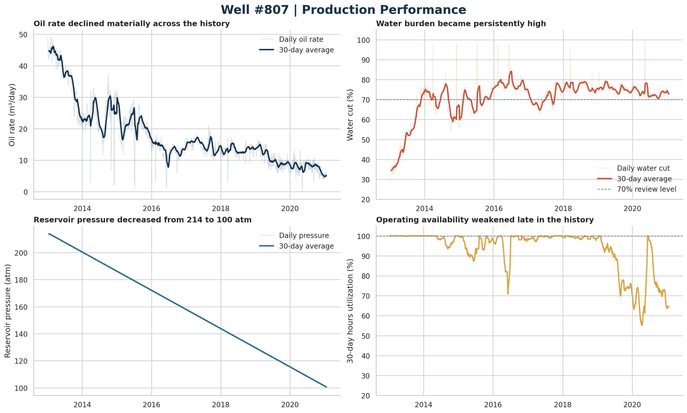
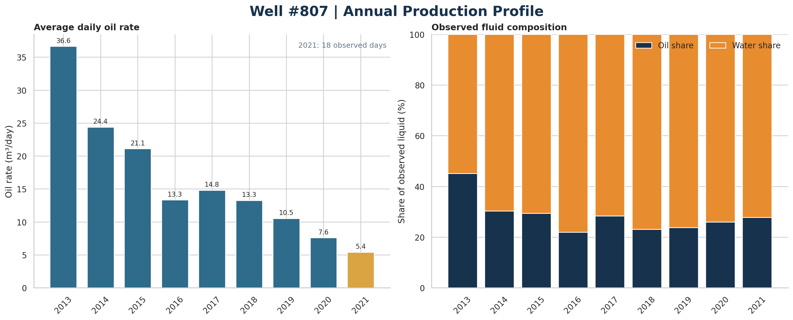
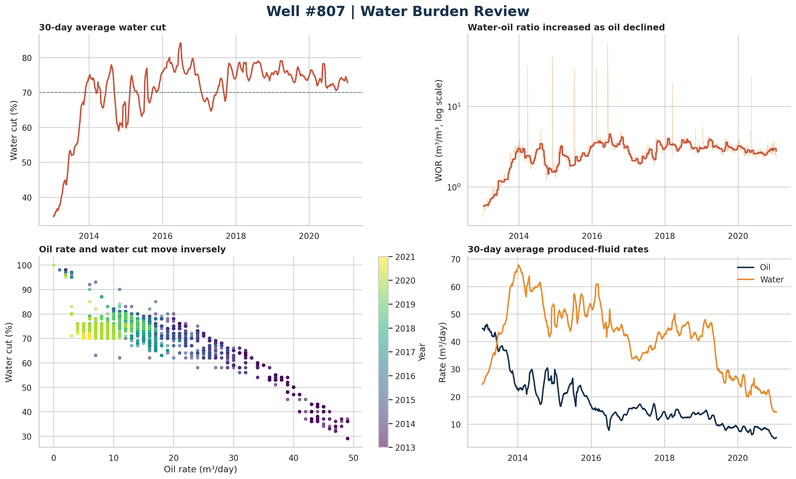
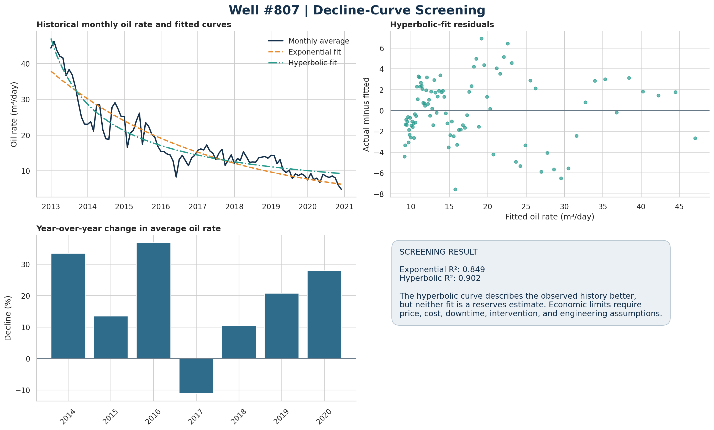
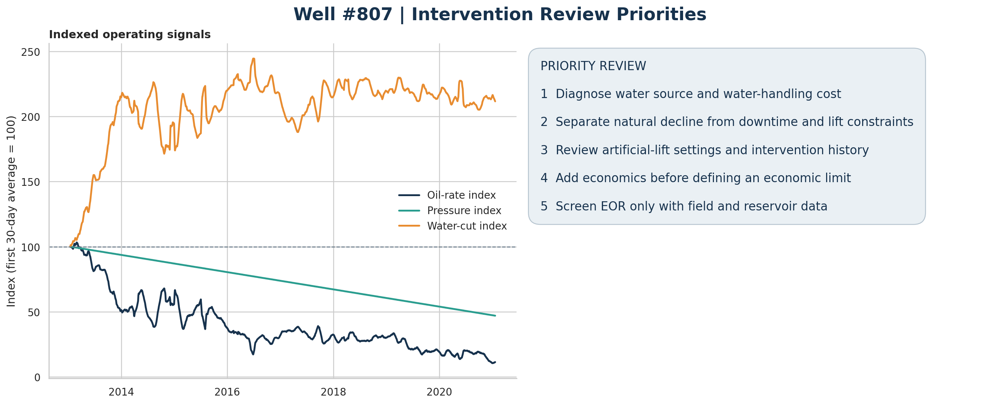

# Oil Well #807 Production Performance Analysis

An evidence-based Python analysis of daily oil production, water cut, reservoir pressure, gas behavior, operating hours, decline trends, and intervention-screening signals from 2013 to 2021.



## Executive Snapshot

| KPI | Verified result |
|---|---:|
| Analysis period | **2013-01-01 to 2021-01-18** |
| Daily observations | **2,939** |
| Oil rate | **49 → 5 m³/day** |
| Oil-rate decline | **89.8%** |
| Average oil rate | **17.62 m³/day** |
| Observed oil volume | **51,798 m³** |
| Water cut | **29% → 70%** |
| Average water cut | **70.69%** |
| Reservoir pressure | **214 → 100 atm** |
| Pressure decline | **53.3%** |
| Operating-hours utilization | **93.10%** |
| Zero-oil observations | **1 day** |

## Technical Decision Context

Mature wells require a combined view of production decline, water burden, reservoir energy, and operating availability. This project evaluates:

- How quickly did the oil rate decline?
- How did water cut change across the well life?
- Does reservoir-pressure depletion align with production deterioration?
- Where do working-hour or zero-rate observations indicate operational disruption?
- Which optimization, water-control, or EOR questions deserve further engineering study?
- What additional data is required before making an economic-limit or abandonment decision?

## Dataset

The published dataset contains **2,939 daily records** and nine source fields:

- Date
- Oil volume
- Total liquid volume
- Gas volume
- Water volume
- Water cut
- Working hours
- Dynamic level
- Reservoir pressure

The cleaned file is available at [data/well_807_production_data.csv](data/well_807_production_data.csv). Excel serial dates were converted to ISO dates and header formatting was normalized.

## Analytical Workflow

1. Validate dates, data types, ranges, and missing values.
2. Examine daily, monthly, and yearly production behavior.
3. Calculate gas-oil ratio, water-oil ratio, and cumulative observed production.
4. Review oil-rate decline, water-cut progression, pressure depletion, and operating hours.
5. Reconcile liquid balance and identify calendar or operating exceptions.
6. Fit exponential and hyperbolic curves for historical screening only.
7. Prioritize operational and intervention questions within explicit evidence limits.

The reproducible [Jupyter notebook](well_807_analysis.ipynb) uses a repository-relative path and contains no saved outputs; run it locally to recreate the analysis.

A concise [portfolio report](docs/well-807-production-analysis-report.pdf) presents the verified findings, charts, and evidence boundaries in a six-page format.

## Verified Findings

### Production decline

- The recorded oil rate declined from **49 m³/day** on the first observation to **5 m³/day** on the last.
- This represents an **89.8% reduction** across the observed period.
- Average daily oil rate across the dataset was **17.62 m³/day**.
- The annual average fell from **36.63 m³/day in 2013** to **7.59 m³/day in 2020**. The 2021 record is partial and covers only 18 days.
- Summing the daily observations gives **51,798 m³ of observed oil volume**. This is historical observed production, not a reserves estimate.

### Water burden

- Water cut increased from **29%** to **70%** between the first and final records.
- Average water cut across all observations was **70.69%**.
- From 2016 onward, **90.7% of daily observations** recorded water cut at or above 70%.
- The sustained water burden strengthens the case for water-handling, conformance, and operating-cost review.

### Reservoir pressure

- Reservoir pressure declined from **214 atm** to **100 atm**.
- The observed reduction was **53.3%**, consistent with material reservoir-energy depletion.
- Pressure decline and oil-rate deterioration should be interpreted together with intervention and artificial-lift history, which are not included in the dataset.

### Operational interruption

- Oil production reached **0 m³/day on 2020-05-11**, while eight working hours were recorded.
- Recorded working hours equal **93.10%** of the theoretical 24-hour daily maximum; 937 observations contain fewer than 24 working hours.
- The dataset confirms the event but does **not** identify its cause.
- Maintenance, operating constraints, shutdown activity, or external events require supporting operational records before attribution.

### Data quality

- Dates are unique and ordered, with one missing calendar date: **2015-05-31**.
- Oil plus water differs from reported total liquid by only 1 m³/day on 464 rows, consistent with rounded source measurements.
- No missing, duplicate, or negative source values were found.

## Visual Analysis

### Production Performance


### Annual Production Profile



### Water Burden



### Decline-Curve Screening



### Intervention Review Priorities



## Engineering Interpretation

The history is consistent with a mature, depleted well with a high produced-water burden. The evidence supports a structured technical and economic review; it does not independently prove that the well should be abandoned or that a particular EOR method will succeed.

Priority review areas include:

1. Artificial-lift and pumping-parameter optimization.
2. Water-source diagnosis and conformance-control review.
3. Workover feasibility assessment using intervention history.
4. Economic-limit analysis including water handling and disposal.
5. Field-level pressure-support or EOR screening only after adding offset-well and reservoir data.
6. Abandonment comparison only after estimating remaining value, operating cost, and liability.

## Recommended Next Analysis

- Add failure, shutdown, workover, and intervention records.
- Separate natural decline from documented downtime.
- Add price, lifting cost, water-disposal cost, and intervention cost.
- Test decline models on engineering-selected stable-production periods and documented operating states.
- Compare the well with field injection and offset-well response.
- Validate any EOR candidate against rock, fluid, pressure, and simulation data.

## KPI and Methodology Documentation

- [KPI reference](docs/kpi-reference.md)
- [Methodology and limitations](docs/methodology-and-limitations.md)

These files document calculations, evidence boundaries, and the distinction between observed results and screening assumptions.

## Tools and Skills Demonstrated

- Python and Pandas
- Matplotlib and Seaborn
- Time-series analysis
- Data cleaning and validation
- Production-performance analysis
- Decline-curve screening without reserves claims
- Water-cut and pressure analysis
- Petroleum-engineering interpretation
- Evidence-based technical communication

## Repository Structure

```text
oil-well-807-analysis/
├── README.md
├── requirements.txt
├── well_807_analysis.ipynb
├── data/
│   ├── well_807_production_data.csv
│   └── raw/well_807_data.csv
├── docs/
│   ├── kpi-reference.md
│   ├── methodology-and-limitations.md
│   └── well-807-production-analysis-report.pdf
└── images/
    ├── production_trend.png
    ├── annual_production_profile.png
    ├── watercut_trend.png
    ├── decline_curve.png
    └── intervention_screening.png
```

## How to Run

1. Clone the repository.
2. Install the dependencies with `pip install -r requirements.txt`.
3. Start Jupyter from the repository root.
4. Open `well_807_analysis.ipynb`.
5. Run the notebook cells to reproduce the tables and charts.

## Validation Note

All exact figures in this README were recomputed from the published CSV. Decline fits, reserves estimates, economic limits, and EOR suitability remain screening-level outputs until supported by complete engineering and economic data.

## Author

**Yasir Awad**  
Data Analyst | Business Intelligence | Energy & Operations Analytics

- [GitHub](https://github.com/Yasir101-hi)
- [LinkedIn](https://www.linkedin.com/in/yasirawad)
- Email: [yasir.petro.analytics@outlook.com](mailto:yasir.petro.analytics@outlook.com)

## Project Status

Completed and reproducible. Exact KPIs, chart labels, decline-screening boundaries, and intervention language have been reconciled with the published data.
