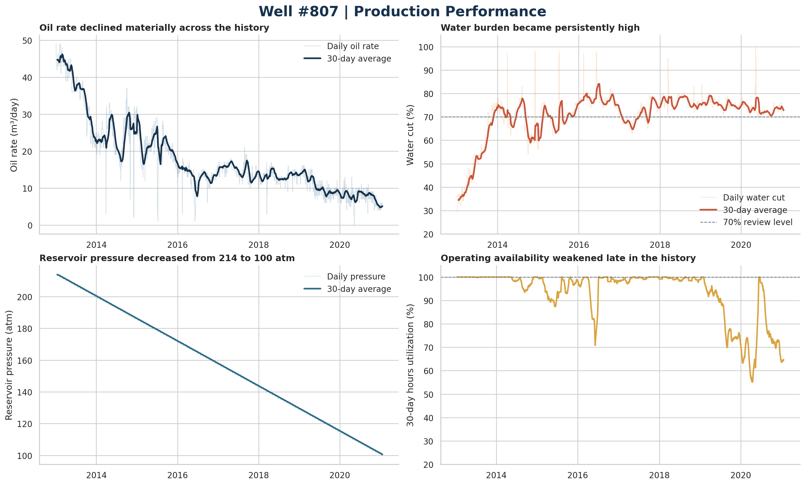
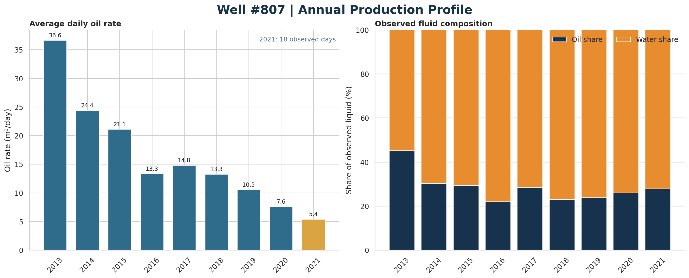
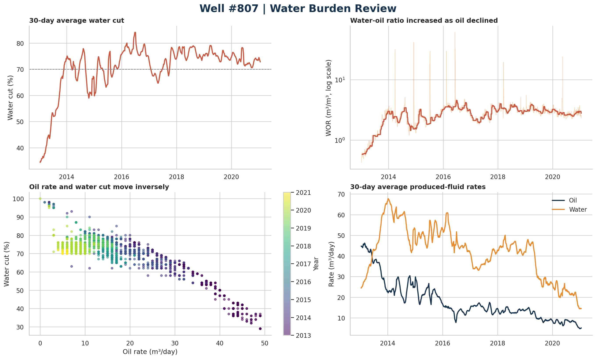
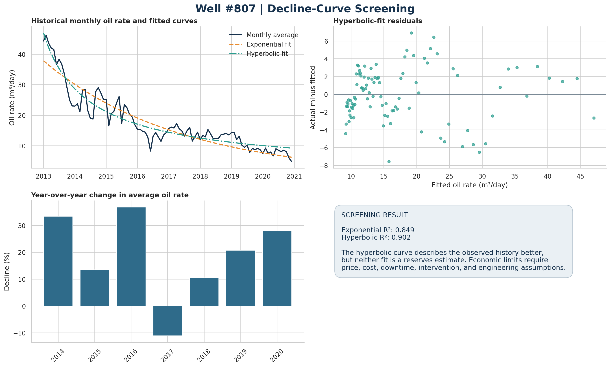
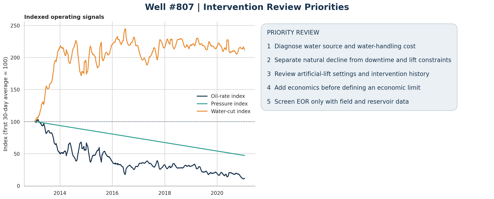

# Oil Well #807 Production Analysis

I built this project to connect my petroleum engineering background with the data-analysis skills I have been developing in Python. I used more than eight years of daily operating data to examine how oil production, water cut, reservoir pressure, and operating hours changed over the life of Well #807.



## Questions I explored

- How did the oil rate change between 2013 and 2021?
- How did increasing water production affect the well's performance?
- Did reservoir-pressure decline follow the reduction in oil rate?
- How much of the production history was affected by reduced operating hours?
- What additional information would be needed before recommending an intervention?

## Data source

The analysis uses the publicly available [Oil well dataset on Kaggle](https://www.kaggle.com/datasets/ruslanzalevskikh/oil-well), published by Ruslan Zalevskikh for learning and analysis. The publisher identifies the data as daily operating records for Well No. 807, a 2,400-m well drilled in 2013 in northern Russia.

The original file contains two header rows followed by 2,939 daily observations. I converted the Excel dates to ISO format and normalized the column names. I did not alter the recorded production measurements.

## What I did

1. Checked dates, missing values, duplicates, negative values, and the liquid balance.
2. Calculated 30-day averages to make the long-term trends easier to see.
3. Aggregated the daily records into monthly and annual summaries.
4. Calculated cumulative observed oil, gas-oil ratio, and water-oil ratio.
5. Compared exponential and hyperbolic curves against the monthly oil-rate history.
6. Used the operating signals to identify questions for further engineering review.

I used the decline curves only to describe the historical trend. I did not use them to estimate reserves or an economic limit because the dataset does not include costs, intervention history, or the information needed to select a stable forecasting period.

## Main findings

| Measure | Result |
|---|---:|
| Period analyzed | 1 Jan 2013 - 18 Jan 2021 |
| Daily observations | 2,939 |
| Oil rate, first to last record | 49 to 5 m³/day |
| Average oil rate | 17.62 m³/day |
| Observed oil volume | 51,798 m³ |
| Water cut, first to last record | 29% to 70% |
| Reservoir pressure, first to last record | 214 to 100 atm |
| Recorded-hours utilization | 93.10% |
| Days with zero recorded oil | 1 |

### Production decline

The oil rate fell by 89.8% between the first and last observations. The annual average declined from 36.63 m³/day in 2013 to 7.59 m³/day in 2020. I excluded 2021 from that comparison because the dataset contains only 18 days for that year.

### Water production

Water cut increased as oil production declined. From 2016 onward, 90.7% of the daily records had water cut at or above 70%. I treated 70% as a convenient reference for reviewing this dataset, not as a universal intervention threshold.

### Pressure and operating time

Reservoir pressure fell from 214 to 100 atm. This supports a depletion interpretation, but the data alone cannot separate reservoir decline from changes in artificial lift or well operations.

There were 937 observations with fewer than 24 working hours. One record, dated 11 May 2020, showed zero oil production and eight working hours. I flagged the date for investigation rather than assigning a shutdown cause that is not recorded in the dataset.

## Engineering interpretation

My reading of the available history is that Well #807 is a mature well affected by declining reservoir pressure and a high produced-water burden. Before recommending a workover, water-control treatment, pressure-support project, or abandonment decision, I would want to review:

- artificial-lift settings and well-test history;
- shutdown, failure, and intervention records;
- completion intervals and water-source diagnostics;
- offset-well and injection response;
- PVT and rock data;
- oil price, lifting cost, water-disposal cost, and intervention cost.

These additional inputs would allow the production decline to be separated from downtime and would support a proper technical and economic comparison of intervention options.

## Results

### Production performance


### Annual production profile



### Water burden



### Historical decline-curve comparison



### Questions for intervention review



## Reproduce the analysis

1. Clone this repository.
2. Install the packages with `pip install -r requirements.txt`.
3. Open `well_807_analysis.ipynb`.
4. Run the cells from the repository root.

The notebook reads `data/well_807_production_data.csv` and recreates the tables and figures shown above.

## Repository structure

```text
oil-well-807-analysis/
├── README.md
├── requirements.txt
├── well_807_analysis.ipynb
├── data/
│   ├── well_807_production_data.csv
│   └── raw/well_807_data.csv
├── docs/
│   ├── kpi-reference.md
│   ├── methodology-and-limitations.md
│   └── well-807-production-analysis-report.pdf
└── images/
    ├── production_trend.png
    ├── annual_production_profile.png
    ├── watercut_trend.png
    ├── decline_curve.png
    └── intervention_screening.png
```

## Author

**Yasir Awad**  
Petroleum Engineering Graduate | Energy Data Analytics

- [GitHub](https://github.com/Yasir101-hi)
- [LinkedIn](https://www.linkedin.com/in/yasirawad)
- Email: [yasir.m.ahmed10@gmail.com](mailto:yasir.m.ahmed10@gmail.com)

